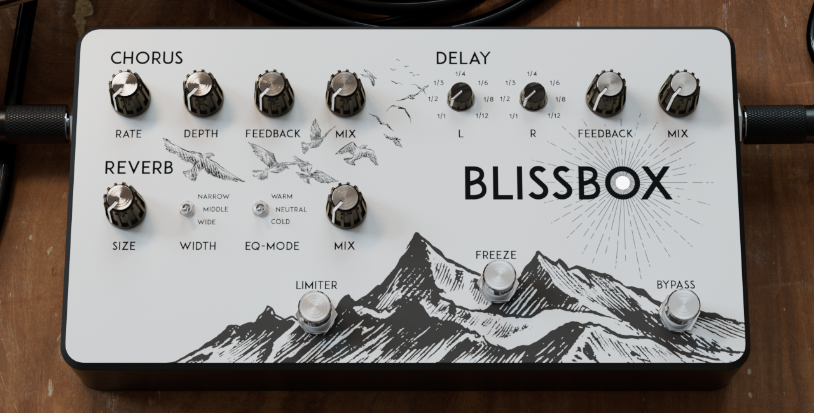
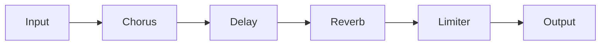

# BlissBox
A guitar pedal VST plug-in made with the [JUCE](https://juce.com/) framework.



## Overview

The BlissBox-Pedal was inspired by the Dispatch Master[^1] by Earthquaker Devices. It combines basic guitar effects, such as chorus, delay and reverb, into a blissful combination for easy use.
The chorus- and reverb-effect are implemented with the `juce::dsp::Chorus` and `juce::dsp::Reverb` modules. The delay-effect is based on a tutorial series[^2][^3] by 
[The Audio Programmer](https://www.theaudioprogrammer.com/). Additionally, the delay features bpm-synchronized times for two channels as well as dry/wet-mixing. To prevent clipping due to high feedback values a limiter provides a hard clipper. The freeze-footswitch puts the reverb into a continuous feedback loop and offers the possibility to generate drone sounds.

For rendering animations, the GUI implementation uses a Filmstripslider-class, based on the plug-in 
[Vib-rato](https://github.com/ColinGill/AudioPlugIn---Vibe-rato) by [Colin Gill](https://github.com/ColinGill/).

### The plug-in implements the following audio signal flow. 


## Compatibility

The provided plug-in is compiled in the VST3 format and may not work in other operating systems besides Windows. I recommend [Reaper](https://www.reaper.fm/), which is technically free, or [FL Studio](https://www.image-line.com/) to use the plug-in.

## GUI

### Importing images into the project

To compile the plug-in with the provided images, one can simply open the projucer-project and import the images via drag and drop into the file explorer. The files will then be marked as binary resources and can be used in the project like so:

`juce::Image example_png = juce::ImageCache::getFromMemory(BinaryData::example_png, BinaryData::example_pngSize);`

### How to combine multiple images into a vertical filmstrip automatically

Download [imagemagick](https://imagemagick.org/script/download.php).

Open the folder that contains the pictures in the terminal and run the following script. 
The processed image is saved in the "output" folder.

```
mkdir output
magick *.png -append "output\\output.png"
```

## Future improvements

- [ ] resize option
- [ ] custom popUpDisplay style
- [ ] volume corrections
- [ ] prevent click's and pop's while changing delay times and feedback
- [ ] preset manager
- [ ] custom dsp algorithms
- [ ] processBlockBypassed function
- [ ] getHostInformation function

## References

[^1]: [Dispatch Master by Earthquaker Devices](https://www.earthquakerdevices.com/dispatch-master)

[^2]: [JUCE Tutorial 15 - Creating a Circular Buffer by The Audio Programmer](https://www.youtube.com/watch?v=2oCb3SXBcTI)

[^3]: [JUCE Tutorial 16 - Creating a Basic Delay Effect by The Audio Programmer](https://www.youtube.com/watch?v=eA5Mhbric6Y)

